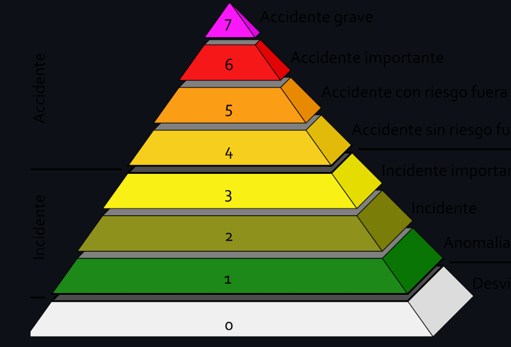
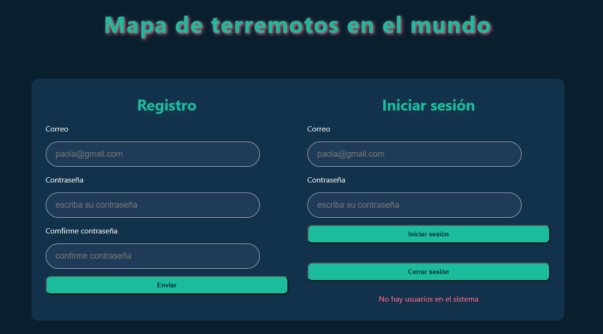
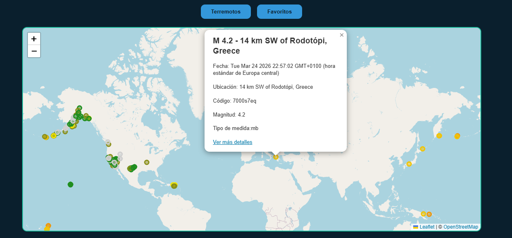
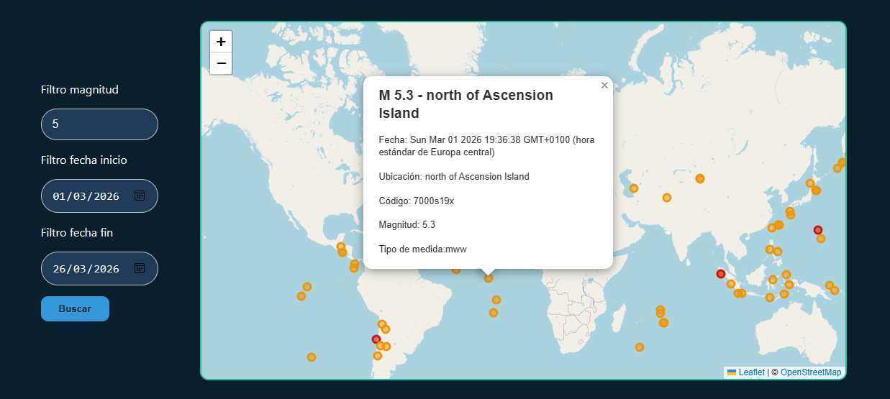

# 🌎 Terremotos - Proyecto Interactivo



**Ver proyecto en vivo:** [https://karinarojasdev.github.io/temblor/](https://karinarojasdev.github.io/temblor/)

---

## 💡 Descripción

Este proyecto muestra **terremotos en tiempo real** en todo el mundo de manera interactiva.
Los usuarios pueden registrarse, iniciar sesión y guardar terremotos favoritos. Todo está pensado con **diseño responsive**, colores modernos y botones con efectos hover.

**Funcionalidades principales:**

* 📍 Visualización de terremotos en un mapa interactivo.
* 🔎 Filtrado por magnitud y rango de fechas.
* ⭐ Guardado y eliminación de favoritos (usuario registrado).
* 🔐 Registro y login con Firebase Authentication.
* 🌐 Hosting con **GitHub Pages**.
* 🖥️ Diseño **mobile-first** y adaptativo.

---

## 🖼️ Capturas de pantalla

### Login y Registro



### Mapa de Terremotos



### Filtros y búsqueda



---

## ⚡ Instalación

1. Clona el repositorio:

```bash
git clone https://github.com/karinarojasdev/temblor.git
```

2. Abre `index.html` en tu navegador o usa un servidor local (recomendado si quieres probar Firebase).

3. ¡Listo! Ya puedes explorar los terremotos, filtrar y añadir favoritos.

---

## 🛠️ Tecnologías utilizadas

* **HTML5 / CSS3 / JavaScript**
* **Leaflet.js** – mapas interactivos.
* **Firebase** – Auth y Firestore.
* **GitHub Pages** – hosting gratuito.
* **Responsive Design** con Flexbox y Media Queries.

---

## 🚀 Cómo usarlo

1. **Registro**: completa el formulario de registro con correo y contraseña.

2. **Inicio de sesión**: ingresa con tu usuario registrado.

3. **Explora el mapa**: haz clic en los marcadores para ver detalles de los terremotos.

4. **Guardar favoritos**: si estás logueado, puedes añadir terremotos a favoritos y luego verlos en el mapa.

5. **Filtrar terremotos**: selecciona magnitud y rango de fechas para ver los resultados en el segundo mapa.

---

## 🤝 Cómo colaborar

1. Haz un fork del repositorio.
2. Crea una nueva rama:

```bash
git checkout -b feature/nueva-funcionalidad
```

3. Realiza tus cambios y haz commit:

```bash
git commit -m "Añade nueva funcionalidad"
```

4. Sube tu rama al repositorio:

```bash
git push origin feature/nueva-funcionalidad
```

5. Abre un Pull Request para que tus cambios sean revisados e integrados.

---

## 📫 Contacto

* 💻 GitHub: [karinarojasdev](https://github.com/karinarojasdev)
* ✉️ Email: [karinacodecompetent@gmail.com](mailto:karinacodecompetent@gmail.com)

---